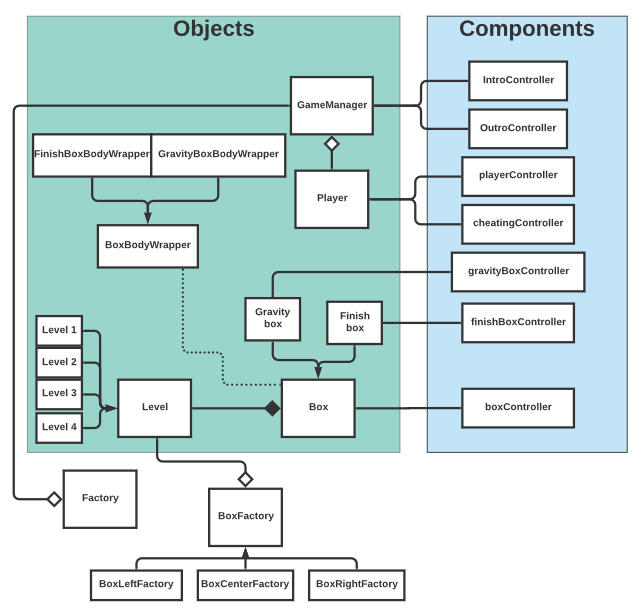

# APHGames template for PIXIJS and ECSLite library

## How to run this project
- the project is powered by ParcelJS, TypeScript, PixiJS and ECSLite libraries
- install [NodeJS](https://nodejs.org/en/download/)
- execute `npm install`
- execute `npm run dev`
- go to `localhost:1234` and find your template there
- **if you fork this project and rebase it to match the current version, don't forget to run `npm ci` to install new dependencies**

## Other scripts
- lint: run `npm run lint` to see if there are linting errors. You can fix them by using `npm run lint -- --fix`
- compilation test: run `npm run compile-test` to see if there are any TypeScript errors. The default building process provided by ParcelJS doesn't check for syntactic errors. Instead, it just skips them. Yet, you should be able to see them underlined in your IDE
- deployment: run `npm run deploy` and find your project in the `build` folder



## Project structure

```
project
│
└───assets                  // folder where you should put your game assets
│   
└───build                   // output folder for your deployed project
│
└───libs                    // libraries and helpers
│   │   aph-math            // math library with structures you can use
│   │   pixi-ecs            // ecslite component-oriented library for pixiJS
│   │   pixi-matter         // bridging components between pixiJS and matterJS
│
└───scripts                 // npm scripts
│   │   fix-links.js        // will fix relative paths in deployed files
│   │   prebuild-project.js // will copy static assets to the build folder before the main build process
│   │   utils.js            // various file utilities
│
└───src                     // source files of your project
│   │   index.ts            // the main source file that is included in the html file
│
└───view                    // folder with HTML content
│   │   index.html          // file that includes TS file with your game
│
│   CHANGELOG.md            // changelog
│   package.json            // npm scripts and dependencies
│   README.md               // README file
│   tsconfig.json           // typescript config (only for pre-build)
```

## Libraries
### aph-math
- Math library with functions for pathfinding, perlin noise, steering behavior, etc. Also, it includes structures such as heap, linked-list, and priority queue
- this library is used by the example repo, the link of which you can find on the [web](https://aphgames.io/docs/niaph/intro)

### pixi-ecs
- ECSLite library for component architecture. The documentation can be found on the [web](https://aphgames.io/docs/niaph/tutorials/ecsdocs)

### pixi-matter
- bridging library between physical library MatterJS and PixiJS. The documentation can be found on the [web](https://aphgames.io/docs/niaph/tutorials/matterjs)

## ParcelJS and Building process
- [parcelJS](https://parceljs.org/) is a simple bundler that requires minimum configuration (alternative to webpack)
- great for prototyping, especially for PixiJS, as we only need a single canvas element and the rest will be stored in scripts
- **how it works**
  - you have a HTML file
  - this file is referencing other files, such as JavaScript files, TypeScript files, SASS styles, LESS,...
  - Parcel tries to process all referenced files and find appropriate parsers for each
  - for instance, TypeScript files need to be compiled into JavaScript, SASS has to be transformed into CSS
  - once everything is completed, Parcel will create **another** file in the output directory (here `build`) where it will store all processed files, appending hash strings to their filenames
  - this directory can be treated as a static webpage

## Things to keep in mind
### Loading textures
- all textures must be in the `assets` folder
- building script will copy this folder into the `build` folder from which it will reference the files
- if you use a wrong url to load your textures, you will see in your console something like `size exceeded: 800 > 0`. The thing is that ParcelJS redirects non-existent URLs to the default page. Therefore, if you try to load a URL like `localhost:1234/abcdef`, it will return `index.html` and PixiJS will treat it as an invalid texture

### Linting
- linter is optional, there are no commit hooks that would prevent you from comitting badly-formatted code
- both linting and compile errors will be shown in your IDE for the sake of better dev experience
- if you wish to check for linting errors explicitly, run the script `npm run lint`
- if you wish to check for compilation errors explicitly, run the script `npm run compile-test`

### Assets and hot reload
- assets are copied only once - when you run `npm run dev`
- even though there is a hot reload that will re-compile your code whenever you change a line, **it won't affect your assets**
- therefore, whenever you change anything in your assets folder, you need to re-run `npm run dev` to see the changes

### Template updates
- ECSLite library is included as a source code instead of an NPM package for a reason - you can make any changes in the `libs` folder as you see fit
- if there are any updates of the `ECSLite` library in the future, it will be also updated in this repo. That is, if you want to keep up with the most recent version, don't forget to update your forked repository
- also, don't forget to run `npm ci` to install any new dependencies that have been added to the `package.json`
- and don't forget to check out the `CHANGELOG` to see what has been changed

### Deployment version
- if you are new to web technologies, keep in mind that your browser will not allow you to load any assets from your file system. That is, you need to run a web-server in order to access any files
- this is done automatically by a web-server that is shipped with ParcelJS
- if you run `npm run dev`, you will find your webserver at `localhost:1234` and everything is fine
- if you, however, deploy your project, and open the `index.html` file located in the `build` folder, the game will not run, unless you deploy it to a web-server (NGinx, XAMPP, or a real web server like S3Bucket or Heroku)